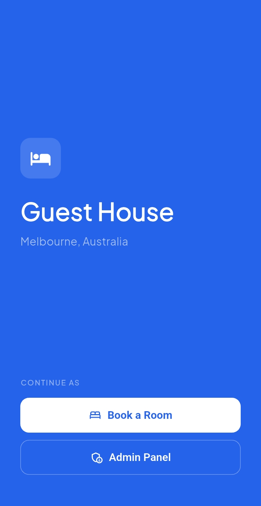
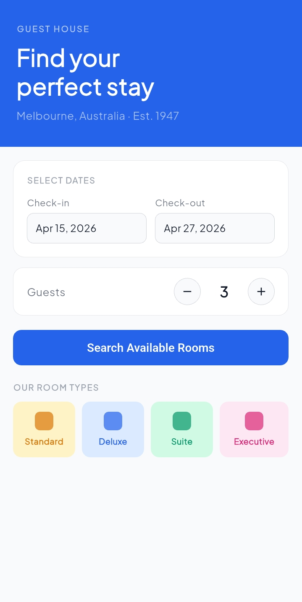
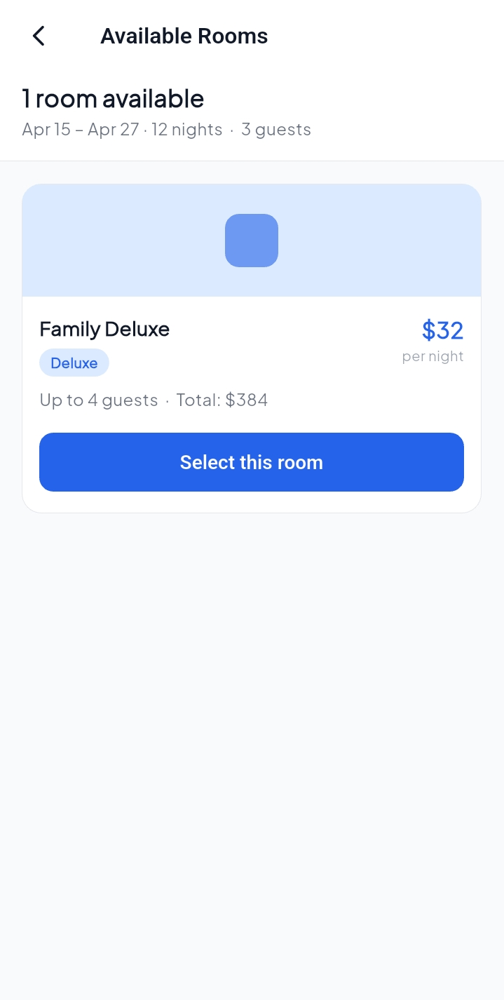
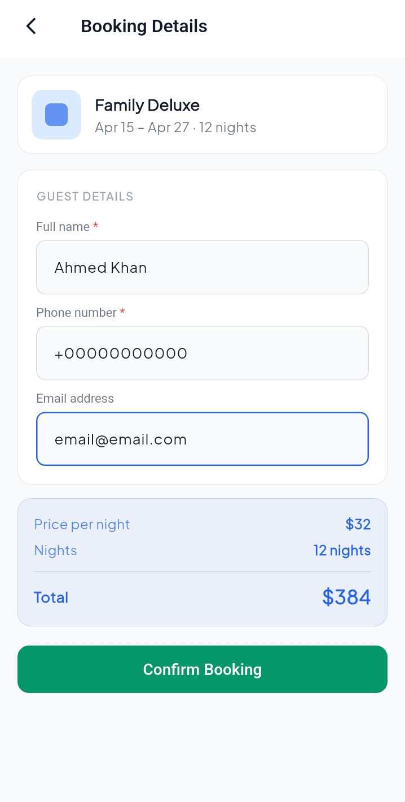
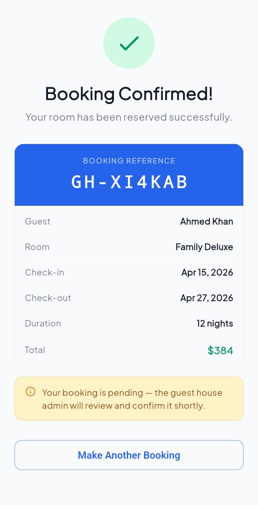

# TAP RESERVATION

TAP RESERVATION is a modern Flutter based guest house booking application designed to provide a smooth and intuitive experience for both customers and administrators. The app allows users to explore available rooms, view details, and complete bookings through a simple and clean flow, while the admin side makes it easy to manage rooms and reservations.

The project is built using clean architecture principles to ensure scalability and maintainability. Riverpod and GetX are used together for efficient and structured state management. At the moment, the app runs on mock data to support development and testing, with plans to integrate Supabase for backend services, authentication, and real time data handling.

## Features

The application provides a complete customer journey starting from browsing rooms to confirming a booking. It also includes an admin panel where rooms and reservations can be managed بسهولة. The architecture is structured in a way that keeps business logic separate from UI, making future updates easier and cleaner.

## Screenshots

Below are some previews of the application screens.

  
  
  
  
  

## Tech Stack

The app is developed using Flutter and follows clean architecture. State management is handled using Riverpod and GetX to ensure flexibility and performance.

## Future Plans

The next phase of the project includes integrating Supabase to enable authentication, database storage, and real time updates. Additional improvements such as payment integration and enhanced user experience are also planned.

## Getting Started

To run this project locally, clone the repository, install dependencies, and start the app.

git clone https://github.com/usman-flutter-dev/tap_reservation.git  
cd tap_reservation  
flutter pub get  
flutter run 
